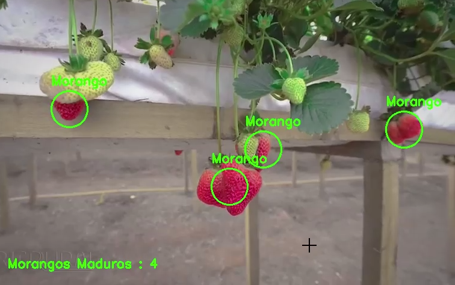

# Detecção e Contagem de Morangos Maduros

Este é um exemplo de código em Python que utiliza a biblioteca OpenCV para detectar morangos maduros em um vídeo e contar quantos morangos foram detectados.

## Pré-requisitos

- Python 3.x
- OpenCV (cv2)
- NumPy

Você pode instalar as dependências Python com o seguinte comando:

```pip install opencv-python numpy```


## Uso

1. Clone o repositório ou baixe o arquivo `MorangoDetector.py`.

2. Execute o script:

```python MorangoDetector.py```

3. O vídeo será exibido com os morangos detectados e a contagem de morangos maduros na parte inferior.

4. Para encerrar a execução, pressione a tecla 'q'.

## Exemplo de Saída



## Contribuições

Contribuições são bem-vindas! Se você encontrar problemas ou melhorias, sinta-se à vontade para abrir uma issue ou enviar uma solicitação pull.

## Licença

Este projeto está licenciado sob a Licença MIT - veja o arquivo [LICENSE](LICENSE) para detalhes.

